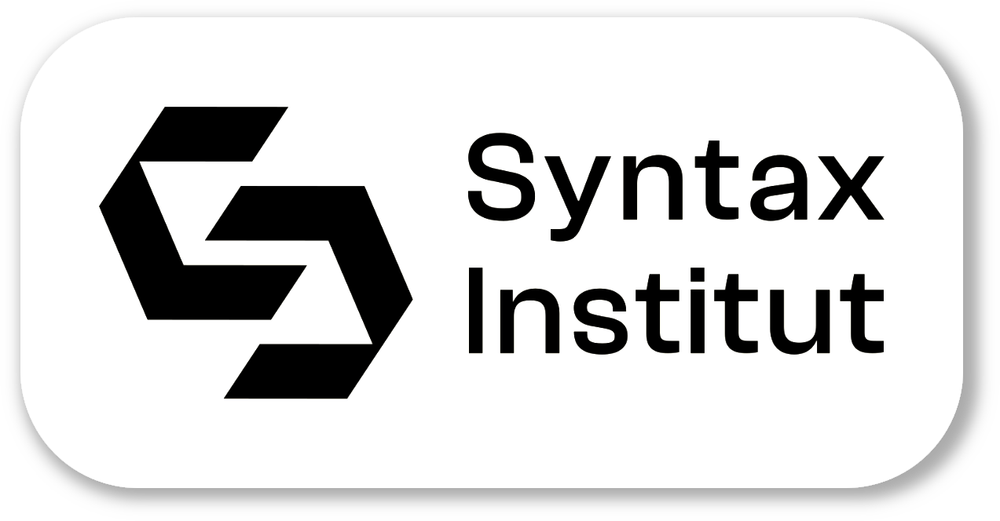

# Titel der Aufgabe

`Grundlagen mit Kotlin` `Titel des Themas`

Eine kurze Beschreibung der Aufgabe. Die Aufgaben werden in einen Kontext gesetzt. Dadurch soll sich ein Sinn hinter
der Bearbeitung ergeben. Beispiele: "Firma XYZ beauftragt dich ein Programm zu schreiben, welches die Nutzerdaten einer
Datingapp speichert und ein Profil anlegt. etc.", "Du arbeitest an einer Anwendung, die das Smart Home eines Kunden
steuert. Deine Aufgabe ist es, ein benutzerfreundliches Programm zu entwickeln, die die Beleuchtung, Heizung, Sicherheit
und andere Smart-Home-Geräte integriert und steuert.", "Du entwickelst ein Programm für Restaurants, welches Kunden
Reservierungen ermöglicht, Menüs anzeigt und Bestellungen entgegennimmt." Tools wie ChatGPT können hier bei der
Formulierung sinnvoll unterstützen.

<p align="center">

</p>
<p align="center">
   <b>Abbildung 1:</b> Die Bildunterschrift, <a href="https://www.pexels.com/de-de/">Quelle</a>
</p>

Ein Bild zur Aufgabe. Z.B. zur Verdeutlichung der Beschreibung. Das Bild befindet sich im `img` Ordner in der
root des student Branch. Das Bild hat eine Bildunterschrift und eine sinnvolle Größe

## Aufgabe 1

> Schreib deinen Code in die Datei _Aufgabe1/src/Aufgabe1.kt_

Sinnvoll aber optional: Bild für die Teilaufgabe

Arbeitsauftrag der ersten Aufgabe. Kurz und effizient formuliert mit allem Wichtigem, was zu Bearbeitung benötigt wird.
Umfang sollte mehr als nur das Deklarieren einer Variablen sein.

Syntax für das Erwähnen einer Variable aus dem Code: Der Name wird in der `name` Variablen gespeichert

```kotlin
// Code-Zitat oder sinnvoller Beispielcode
val name = "Syntax Institut"
println("Der Name des Instituts ist $name")
```

```text
Hello World

Dies ist eine Konsolenausgabe

Process finished with exit code 0
```

> Hinweis:  
> Dies und das musst du bei der Bearbeitung beachten

<details>
<summary><b>Tipps zur Bearbeitung</b></summary>

Weitere Informationen um langsameren TN weiterzuhelfen. Achtung: die Leistung soll hier trotzdem durch den TN erbracht
werden.  

Bsp.: Hilfreiche Keybinds für die Aufgabe:
- <font size="5">2x <kbd>⌥ Option</kbd> dann mit <kbd>↓</kbd></font> mehrere Zeilen anwählen
- `first`/`second` schreiben
- <font size="5"><kbd>⇧ Shift</kbd> + <kbd>→</kbd></font> zum makieren des alten ersten Buchstabens
- <font size="5"><kbd>⇧ Shift</kbd> + <kbd>⌘ Command</kbd> + <kbd>U</kbd></font> um den Buchstaben von Klein- auf Großschreibung zu wechseln

Bsp.: Verlinkungen zur Dokumentation:  
[**Kotlin Dokumentation**](https://kotlinlang.org/)

</details>

## Aufgabe 2

...

## Bonus

...

<!-- Passendes Emoji zur Aufgabe -->
#### Viel Erfolg 🚀 

<p align="end">
  <a href="https://www.syntax-institut.de/">
    
  </a>
</p>
